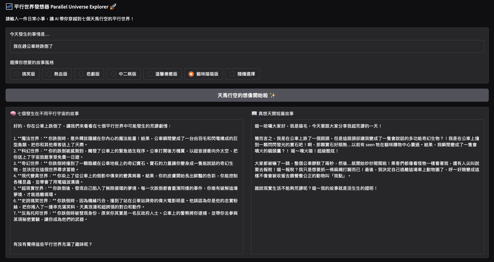
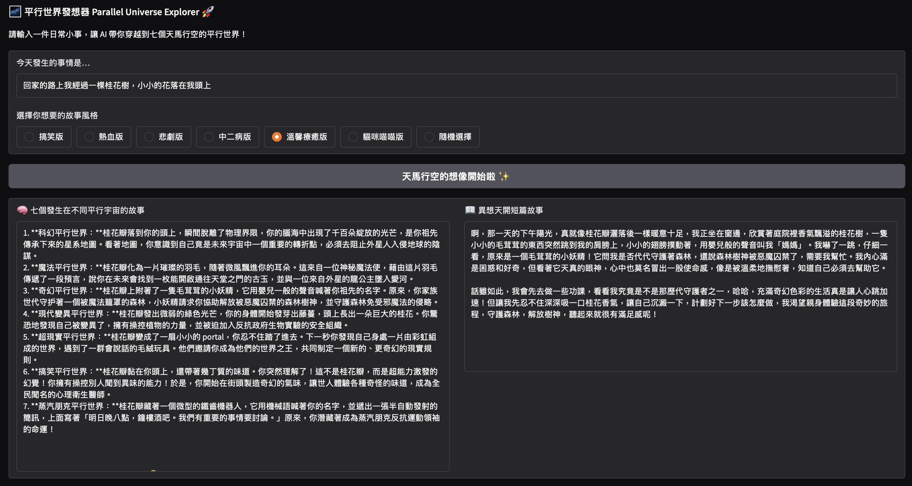
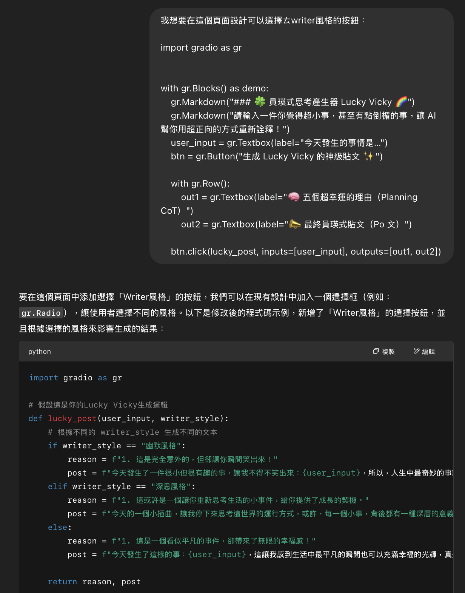
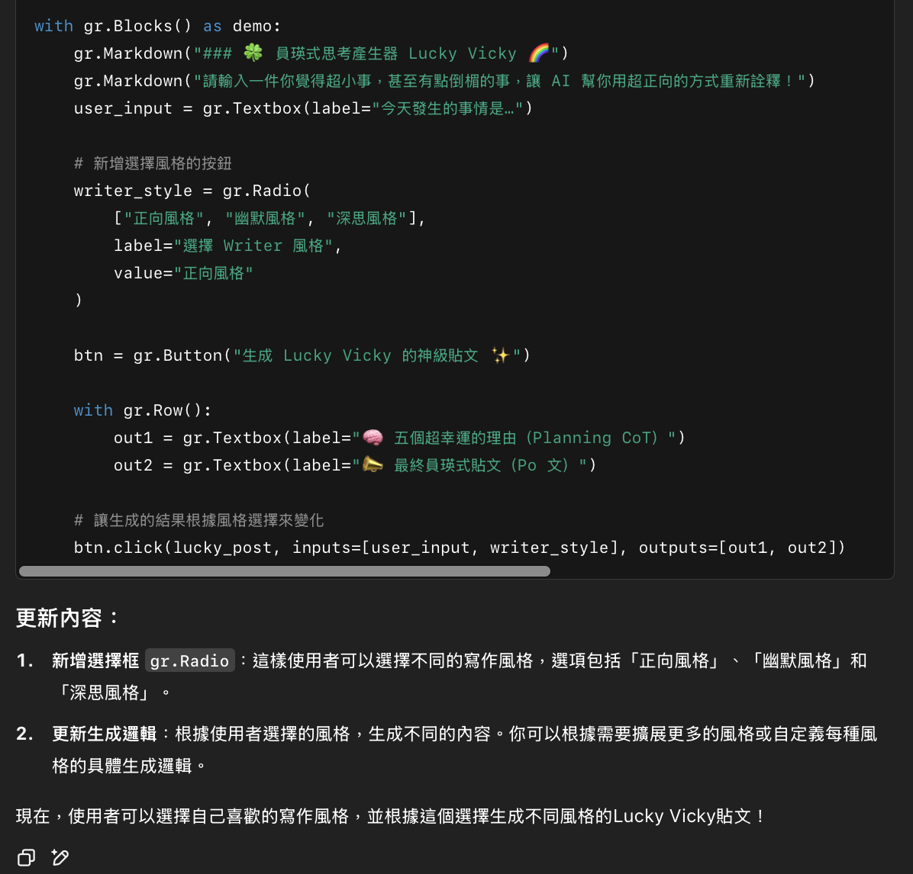

## 陽明交大_111700045_管科大三_蕭玉琁_CoT 平行世界的另一個故事

本次主題 平行世界的另一個故事 靈感來源於電影《媽的多重宇宙》，電影中以「多重宇宙」作為敘事背景，展開了充滿想像力、荒謬與情感交織的冒險故事。這讓我開始思考生活中發生的每一件事，在另一個宇宙裡會不會有完全不一樣的詮釋？基於這樣的構想，本次作業設計以 Chain of Thought（CoT）推理流程 進行改寫，分為 Planning 及 Writing 兩階段。

### 1. colab 連結: [平行世界的另一個故事](https://colab.research.google.com/drive/1pKJA1kOLSm8VdnSdk8OEGMY1yIZvYTks?usp=sharing)

### 2. 二階段思考的人設設定

- Planner: 聚焦於擴展思維、發想多元劇情；
- Writer: 專注於根據指定風格，詮釋故事細節表達。

| 階段     | 人設                     | 說明 |
|----------|--------------------------|------|
| Planning | 腦洞平行世界作家         | 擅長從一件日常小事，想像七個在不同平行宇宙（如科幻、魔法、奇幻、現代變異、超現實、搞笑……等）發生的荒謬劇情。 |
| Writing  | 短篇故事小說家（多風格） | 根據挑選出的最荒謬劇情，擴寫成一段符合指定風格（如搞笑版、熱血版、悲劇版、中二病版、溫馨療癒版）的第一人稱短篇故事。 |

**system_planner**= "
請用台灣習慣的中文回應：你是一位腦洞超大的平行世界作家，擅長根據日常事件想像（如科幻、魔法、奇幻、現代變異、超現實、搞笑...等）在不同平行世界中發生的荒謬劇情。請條列式列出七種，每一個劇情 3-4 句話描述即可。
"
**def get_system_writer(style)**:
return f"請用台灣習慣的中文回應：你是一位{style}的短篇小說家。請從五個平行世界劇情中選出一個最荒謬的，並將它擴寫成一段第一人稱小故事（大約100-200字），口吻要符合「{style}」的感覺，可以自由發揮細節和情緒。"

### 3. 風格選擇互動
使用者可以點選想要的故事風格按鈕，也能選擇「隨機」，增加每次生成的變化和趣味。

### 4. Gradio的對話結果

### 5. Appendix

因為想要加強跟使用者的互動性，希望在頁面上新增按鈕，因此嘗試將老師的原程式碼及要求作為 prompt 丟入 chat GPT：

而後改寫框架內容，帶入我的主題中，並將按鈕選項獨立為 list、新增“隨機”項目。